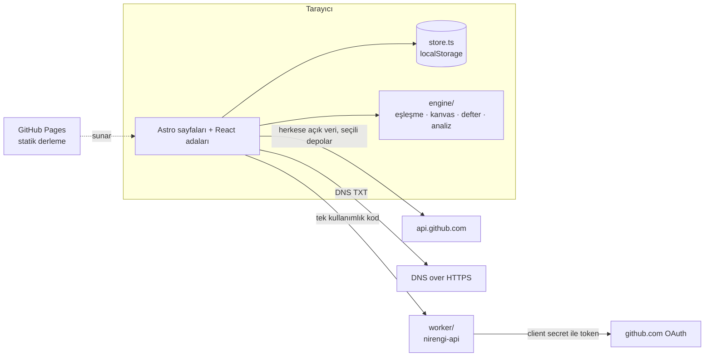

# NİRENGİ

**Beyan değil, kanıt.** Gençlerin ürettiği doğrulanabilir işi kurumların yapılandırılmış ihtiyaçlarıyla buluşturan ve iş birliğini iki tarafın onayıyla kayda geçiren açık kaynak web hizmeti. Zemin360 Hackathon (9–11 Ekim 2026) için geliştirildi.

> Nirengi noktası: haritacılıkta üzerine güvenle ölçüm yapılan sabit referans.

## Demo

- **Canlı:** https://finetiontr.github.io/Nirengi/ (kurulum gerekmez; veri tarayıcıda tutulur)
- **Sunum:** [`/sunum`](https://finetiontr.github.io/Nirengi/sunum), uygulamanın içinde Niri’nin anlattığı deste
- **Sahne akışı:** [`docs/DEMO.md`](docs/DEMO.md), 5 dakikalık demo ve yedek senaryo

## Çözdüğü problem

Kurumlar ihtiyacını net tanımlayamıyor, gençler ise ürettiklerini kanıtlayamıyor: iki taraf da beyana bakarak karar veriyor. NİRENGİ yarışmanın altı problemine birer çalışan ekranla cevap verir:

| # | Problem | Mekanizma | Ekran |
|---|---------|-----------|-------|
| 01 | Genç yeteneklerin keşfi | Kör keşif (isim/yaş/okul gizli), problemle arama, takipçiden bağımsız yükselen sinyal | `/kesfet` |
| 02 | Profil & portfolyo doğruluğu | S1/S2/S3 Doğrulama Merdiveni, **GitHub uygulamasıyla** seçilen depoların (özel depolar dahil) doğrulanması, DNS TXT doğrulaması, kopya eser tespiti, şeffaf itiraz | `/kanit-bagla`, `/profil/:kullanici` |
| 03 | Kurum–kişi eşleşmesi | Dört bileşenli açıklanabilir skor, gerekçe kartı, eksik kanıt geri bildirimi, takım kompozisyonu | `/ihtiyaclar/:id#adaylar` |
| 04 | Yaşayan bir ağ | Olay akışı, bağlantı sağlığı ve somut sebepli yeniden temas, mikro-etkileşimler, çeyreklik ihtiyaç turu | `/nabiz` |
| 05 | İhtiyaçların net tanımı | Yedi alanlı İhtiyaç Kanvası, çözülebilirlik skoru, yayın eşiği, serbest metinden taslak, ekosistem hafızası | `/ihtiyaclar/yeni` |
| 06 | Şeffaf iş birliği takibi | Kriterden doğan kilometre taşları, çift onay, SHA-256 zincirli defter, sessizlik göstergesi, adil kapanış, kamuya açık özet kartı | `/pilotlar/:id`, `/kart/:id` |

Döngü: pilotta çift onaylanan her kilometre taşı kişinin profiline **S3 kanıt** olarak işlenir; kanıt keşfi ve eşleşmeyi güçlendirir; olaylar ağı canlı tutar.

## Özellikler

**Genç**
- GitHub’a bağlan: Nirengi uygulamasını kurarken kurumlara göstereceğin depoları GitHub’da sen seçersin; seçilenler Doğrulandı düzeyinde gelir. Kod ya da anahtar kopyalanmaz.
- Bugün: haftalık hedef, hafta serisi, Şimdi şeridinde günün kurum ihtiyaçları.
- Görevler, lig, topluluk ve Saha defteri; XP yalnız doğrulanmış olaylardan gelir.
- Niri: ilk açılışta yol gösteren, analiz ve haftalık özet sunan asistan.

**Kurum**
- İhtiyaç Kanvası: serbest metinden taslak, çözülebilirlik skoru, yayın eşiği.
- Kör aday listesi, “Neden bu uyum?” gerekçesi, deneme projesi teklifi.
- Pilot: kilometre taşları, çift onay, kurcalanamaz defter, kamuya açık özet kartı.

## Mimari



- **Statik site + tek sunucu parçası.** Site GitHub Pages’te statik çalışır (`npm run build:pages`). GitHub uygulamasının tek kullanımlık kodunu token’a çevirmek gizli anahtar ister; bunu yalnız `worker/` yapar. Worker durum tutmaz, hesap kimliği içermez, herhangi bir Cloudflare hesabına taşınabilir ([`worker/README.md`](worker/README.md)).
- **Astro 7 + React 19 + Tailwind 4 + framer-motion.** Sayfalar Astro’da önceden derlenir; etkileşimli ekranlar React adalarıdır. Hareketler framer-motion ile yapılır, hareket azaltma tercihine uyulur.
- **Saf motor.** `src/lib/engine/` arayüzden bağımsız, test edilen fonksiyonlardır. Bütün skorlar her görüntülemede yeniden hesaplanır; formüller `/yontem` sayfasında.
- **Görsel dil: Pafta.** Harita paftası, nirengi üçgenleri, kontur çizgileri, Bricolage Grotesque. Kurallar [`DESIGN.md`](DESIGN.md). Fontlar pakete gömülü: sahnede internet kesilse de arayüz çalışır.
- Demo verisi tarayıcıda tutulur. İki pencerede **Kurum** ve **Genç** rolü açılırsa çift onay canlı gösterilir; durum sekmeler arasında anında senkronlanır.

### Gerçek olan, demo olan

| Bileşen | Durum |
|---------|-------|
| GitHub uygulaması (seçili depolar), bio/gist kodu, DNS TXT | Gerçek servislere gider |
| Eşleşme, kanvas skoru, takım önerisi, defter bütünlüğü | Gerçek hesaplama |
| Taslak motoru, Niri’nin analizleri | Kural tabanlı, çevrim dışı |
| Kurumlar, kişiler, S3 tasdikleri | Kurgusal demo verisi |
| Kalıcılık | Tarayıcı (`localStorage`) |

## Yapay zekâ kullanımı

Bugün üründe bir dil modeli **çalışmıyor**. Kanvas taslağı (`src/lib/engine/canvas.ts`) ve Niri’nin analizleri (`src/lib/engine/insight.ts`) kural tabanlıdır ve `/yontem` sayfasında da böyle etiketlenir. Model eklendiğinde bu bölüm modeli, neden seçildiğini ve sınırlarını (hatalı çıktıya karşı önlemler dahil) yazacak.

## Kurulum

```bash
npm install
npm run dev          # http://localhost:4321
npm test             # motor ve worker testleri (node:test)
npm run typecheck
npm run build        # Node sunucusu için
npm run build:pages  # GitHub Pages için statik derleme → dist-pages/
```

Node 22+ gerekir (testler TypeScript’i doğrudan çalıştırır). GitHub’a bağlan akışı yerelde `worker/` ile denenir: [`worker/README.md`](worker/README.md).

## Dosya yapısı

```
src/
  pages/               rotalar (Türkçe yol adları)
  layouts/             sayfa iskeletleri
  components/
    landing/           tanıtım sayfası bölümleri
    genc/              genç yüzü: Bugün, Şimdi şeridi, görevler, lig, topluluk, Saha defteri
    kurum/             kurum yüzü: ana sayfa, haftalık özet
    app/               ortak uygulama ekranları (kanıt bağla, ihtiyaç, pilot, profil, keşif)
    assistant/         Niri: karşılama, turlar, yardım
    shell/             menü, hesap, rol anahtarı
    sunum/             uygulama içi sunum destesi
    method/            /yontem sayfası parçaları
    ui/                ortak parçalar (Niri, ikonlar, düğmeler)
  lib/
    engine/            saf hesaplama: match, canvas, ledger, progress, insight
    auth.ts            GitHub uygulamasıyla bağlanma ve çıkış
    verify.ts          GitHub ve DNS TXT doğrulaması
    store.ts           tarayıcıda durum ve sekmeler arası senkron
    seed.ts            kurgusal demo ekosistemi
  styles/global.css    renk ve tipografi tokenları
worker/                tek sunucu parçası: GitHub token değişimi (Cloudflare Worker)
scripts/               GitHub Pages derlemesi, sunum dışa aktarımı
tests/                 node:test testleri
docs/                  başvuru, demo akışı, pazar analizi, sunum notları
```

## Takım

- Sezer Uzun
- Emirhan Açık

## Lisans

[MIT](LICENSE)
