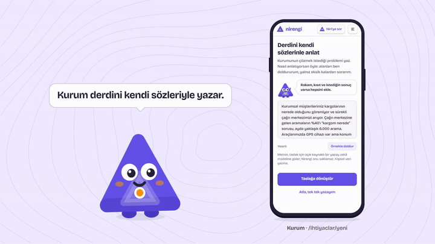
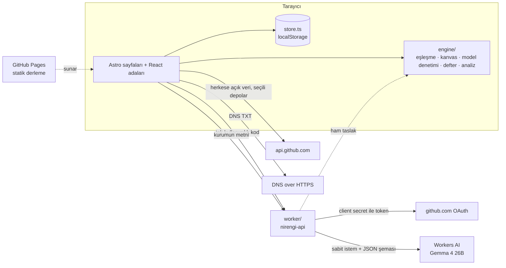

# NİRENGİ

**Beyan değil, kanıt.** Gençlerin ürettiği doğrulanabilir işi kurumların yapılandırılmış ihtiyaçlarıyla buluşturan ve iş birliğini iki tarafın onayıyla kayda geçiren açık kaynak web hizmeti. Zemin360 Hackathon (9–11 Ekim 2026) için geliştirildi.

> Nirengi noktası: haritacılıkta üzerine güvenle ölçüm yapılan sabit referans.

## Demo



- **Tanıtım filmi:** [48 saniye, müzikli](https://finetiontr.github.io/Nirengi/sunum/nirengi-film.mp4); her özelliği ürünün gerçek ekranlarıyla gösterir, sunumun 6. slaytında oynar. Müziği kodla bestelendi, lisansı bize ait. Uzun anlatım: [79 saniye, sessiz](https://finetiontr.github.io/Nirengi/sunum/nirengi-tanitim-web.mp4), Niri ekranları telefonda gezdirir.
- **Canlı:** https://finetiontr.github.io/Nirengi/ (kurulum gerekmez; veri tarayıcıda tutulur)
- **Sunum:** [`/sunum`](https://finetiontr.github.io/Nirengi/sunum), uygulamanın içinde Niri’nin anlattığı 12 slaytlık deste; yapay zekâ slaytları ürünün kendi denetimini gerçek bir model cevabı üzerinde çalıştırır
- **Sahne akışı:** [`docs/DEMO.md`](docs/DEMO.md), 5 dakikalık demo ve yedek senaryo

## Çözdüğü problem

Kurumlar ihtiyacını net tanımlayamıyor, gençler ise ürettiklerini kanıtlayamıyor: iki taraf da beyana bakarak karar veriyor. NİRENGİ yarışmanın altı problemine birer çalışan ekranla cevap verir:

| # | Problem | Mekanizma | Ekran |
|---|---------|-----------|-------|
| 01 | Genç yeteneklerin keşfi | Kör keşif (isim/yaş/okul gizli), problemle arama, takipçiden bağımsız yükselen sinyal | `/kesfet` |
| 02 | Profil & portfolyo doğruluğu | S1/S2/S3 Doğrulama Merdiveni, **GitHub uygulamasıyla** seçilen depoların (özel depolar dahil) doğrulanması, DNS TXT doğrulaması, kopya eser tespiti, şeffaf itiraz | `/kanit-bagla`, `/profil/:kullanici` |
| 03 | Kurum–kişi eşleşmesi | Dört bileşenli açıklanabilir skor, gerekçe kartı, eksik kanıt geri bildirimi, takım kompozisyonu | `/ihtiyaclar/:id#adaylar` |
| 04 | Yaşayan bir ağ | Olay akışı, bağlantı sağlığı ve somut sebepli yeniden temas, mikro-etkileşimler, çeyreklik ihtiyaç turu | `/nabiz` |
| 05 | İhtiyaçların net tanımı | Yedi alanlı İhtiyaç Kanvası, kurumun kendi sözlerinden **yapay zekâ taslağı** (her alan metindeki cümlesine dayanır), önerilen başarı kriterleri, çözülebilirlik skoru, yayın eşiği, ekosistem hafızası | `/ihtiyaclar/yeni` |
| 06 | Şeffaf iş birliği takibi | Kriterden doğan kilometre taşları, çift onay, SHA-256 zincirli defter, sessizlik göstergesi, adil kapanış, kamuya açık özet kartı | `/pilotlar/:id`, `/kart/:id` |

Döngü: pilotta çift onaylanan her kilometre taşı kişinin profiline **S3 kanıt** olarak işlenir; kanıt keşfi ve eşleşmeyi güçlendirir; olaylar ağı canlı tutar.

## Özellikler

**Genç**
- GitHub’a bağlan: Nirengi uygulamasını kurarken kurumlara göstereceğin depoları GitHub’da sen seçersin; seçilenler Doğrulandı düzeyinde gelir. Kod ya da anahtar kopyalanmaz.
- Bugün: haftalık hedef, hafta serisi, Şimdi şeridinde günün kurum ihtiyaçları.
- Görevler, lig, topluluk ve Saha defteri; XP yalnız doğrulanmış olaylardan gelir.
- Niri: ilk açılışta yol gösteren, analiz ve haftalık özet sunan asistan.

**Kurum**
- İhtiyaç Kanvası: kurum derdini kendi sözleriyle yazar, Niri açık bir modelle alanlara ayırır ve ölçülebilir başarı kriterleri önerir; her alanın hangi cümleden geldiği görünür. Çözülebilirlik skoru ve yayın eşiği kurallarla hesaplanır.
- Kör aday listesi, “Neden bu uyum?” gerekçesi, deneme projesi teklifi.
- Pilot: kilometre taşları, çift onay, kurcalanamaz defter, kamuya açık özet kartı.

## Mimari



- **Statik site + tek sunucu parçası.** Site GitHub Pages’te statik çalışır (`npm run build:pages`). Tarayıcıda yapılamayan iki iş `worker/` içindedir: GitHub uygulamasının tek kullanımlık kodunu gizli anahtarla token’a çevirmek ve ihtiyaç taslağını Workers AI’daki modele okutmak. Worker durum tutmaz, hesap kimliği içermez, herhangi bir Cloudflare hesabına taşınabilir ([`worker/README.md`](worker/README.md)).
- **Astro 7 + React 19 + Tailwind 4 + framer-motion.** Sayfalar Astro’da önceden derlenir; etkileşimli ekranlar React adalarıdır. Hareketler framer-motion ile yapılır, hareket azaltma tercihine uyulur.
- **Saf motor.** `src/lib/engine/` arayüzden bağımsız, test edilen fonksiyonlardır. Bütün skorlar her görüntülemede yeniden hesaplanır; formüller `/yontem` sayfasında.
- **Görsel dil: Pafta.** Harita paftası, nirengi üçgenleri, kontur çizgileri, Bricolage Grotesque. Kurallar [`DESIGN.md`](DESIGN.md). Fontlar pakete gömülü: sahnede internet kesilse de arayüz çalışır.
- Demo verisi tarayıcıda tutulur. İki pencerede **Kurum** ve **Genç** rolü açılırsa çift onay canlı gösterilir; durum sekmeler arasında anında senkronlanır.

### Gerçek olan, demo olan

| Bileşen | Durum |
|---------|-------|
| GitHub uygulaması (seçili depolar), bio/gist kodu, DNS TXT | Gerçek servislere gider |
| Eşleşme, kanvas skoru, takım önerisi, defter bütünlüğü | Gerçek hesaplama |
| İhtiyaç taslağı | Yapay zekâ: Gemma 4 26B (Workers AI); ağ ya da kota yoksa kural motoru |
| Niri’nin analizleri ve haftalık özetleri | Kural tabanlı, çevrim dışı |
| Kurumlar, kişiler, S3 tasdikleri | Kurgusal demo verisi |
| Kalıcılık | Tarayıcı (`localStorage`) |

## Yapay zekâ kullanımı

**Ne yapıyor.** Kurum derdini kendi sözleriyle yazar (`/ihtiyaclar/yeni` → **Taslağa dönüştür**). Model metni İhtiyaç Kanvası’nın alanlarına ayırır (mevcut durum, sorun, sorunun ölçüsü, beklenen sonuç, kısıtlar, karar verici, kapsam), her alan için dayandığı cümleyi verir, işin gerektirdiği yetkinlikleri seçer ve 2–3 ölçülebilir başarı kriteri önerir. Kurum **Metninden çıkardıklarım** ekranında neyin hangi cümleden geldiğini ve neyin reddedildiğini görür; eksikleri tamamlar, önerilerden istediğini ekler.

**Model.** Google Gemma 4 26B A4B (`@cf/google/gemma-4-26b-a4b-it`), Cloudflare Workers AI üzerinde. Düşünme kipi kapalı, sıcaklık 0,1, çıktı JSON şemasıyla sınırlı. İstem ve şema [`worker/draft.ts`](worker/draft.ts) içinde sabittir; tarayıcıdan yalnızca metin gider, uç genel amaçlı bir sohbet botu olarak kullanılamaz.

**Neden bu model.**
- **Açık:** ağırlıkları açık ve Apache 2.0 lisanslı. Açık kaynak bir hizmetin modeli de açık; istenirse aynı model kendi sunucunda çalışır.
- **Ücretsiz:** Workers AI’ın günlük ücretsiz kotası (10.000 nöron) içinde kalır. Bir taslak yaklaşık 28 nöron, yani günde 350 civarı taslak. Hesap Workers Free planındadır: kota dolunca fatura çıkmaz, istek reddedilir ve kural motoru devreye girer.
- **Hızlı ve uyumlu:** örnek metinde denediğimiz dört açık model (gpt-oss-120b, gpt-oss-20b, Mistral Small 3.1, Gemma 4) arasında JSON şemasına uyan, Türkçe metni doğru alanlara ayıran en hızlı (5–15 sn) ve en az nöron harcayan modeldi.

**Önce ve sonra.** Örnek metin (“Örnekle doldur”), aynı kurallarla puanlanır; sayılar `tests/ground.test.ts` içinde sabitlenmiştir.

| | Kural motoru | Model |
|---|---|---|
| Doldurulan alan | 5 / 7 | 7 / 7 |
| Karar verici ve kapsam | bulunamadı, sorulur | metindeki cümleden |
| Başarı kriteri | yok | 2 öneri; kurum ekler |
| Netlik puanı | 60, yayımlanamaz | 75; öneriler eklenince 100, yayına hazır |

**Hatalı çıktıya karşı önlemler** ([`src/lib/engine/ground.ts`](src/lib/engine/ground.ts), testleri [`tests/ground.test.ts`](tests/ground.test.ts)):
1. **Kaynak cümle şartı.** Modelin doldurduğu her alan, metinden harfi harfine alınmış bir cümleye dayanmalı. Cümle metinde yoksa alan kanvasa girmez, kuruma soru olarak döner.
2. **Sayı denetimi.** Alandaki her sayı metinde geçmeli; model “6.000” yerine “8.000” yazarsa alan reddedilir.
3. **Kriterler öneridir.** Kurum “Ekle”ye basmadan kanvasa girmez. Eşik ya da somut teslim içermeyen öneri, kanvasın kendi ölçülebilirlik kuralından geçemez ve gösterilmez.
4. **Yayın kararı modelde değil.** Netlik puanı, 70 eşiği ve üç zorunlu madde kurallarla hesaplanır.
5. **Reddedilen gizlenmez.** “Almadıklarım” listesinde nedeniyle görünür.
6. **Yedek yol.** Ağ, kota ya da model sorununda taslağı kural motoru ([`canvas.ts`](src/lib/engine/canvas.ts)) çıkarır ve ekran bunu söyler. Aynı metnin cevabı tarayıcıda saklanır; sahnede ağ kesilse de çalışır.
7. **Kötüye kullanım.** Uç yalnız izinli sitelerden çağrılır; metin 30–2.000 karakter; ziyaretçi başına dakikada 20 istek.

**Sınırlar.**
- Kaynak cümle şartı uydurmayı yakalar, yanlış yorumu yakalamaz: model bir cümleyi yanlış alana koyabilir. Her alanın altında dayandığı cümle göründüğü için kurum bunu görür ve düzeltir.
- Metne yazılmış talimatlar modeli etkileyebilir; çıktı yine aynı denetimlerden geçer ve yalnız o kurumun kendi taslağına düşer.
- Günlük ücretsiz kota dolarsa o gün kural motoru çalışır.
- Kurumun metni taslak için Cloudflare’e gider, Nirengi saklamaz. Ekran kişisel veri yazılmamasını ister.

**Yapay zekâ olmayan yerler.** Eşleşme skoru, netlik puanı, kayıt defteri, Niri’nin analizleri ve haftalık özetleri kural tabanlıdır; formülleri `/yontem` sayfasındadır.

## Kurulum

```bash
npm install
npm run dev          # http://localhost:4321
npm test             # motor ve worker testleri (node:test)
npm run typecheck
npm run build        # Node sunucusu için
npm run build:pages  # GitHub Pages için statik derleme → dist-pages/
```

Node 22+ gerekir (testler TypeScript’i doğrudan çalıştırır). GitHub’a bağlan akışı ve modelle taslak yerelde `worker/` ile denenir: [`worker/README.md`](worker/README.md). Worker yoksa taslağı kural motoru çıkarır, uygulamanın geri kalanı aynen çalışır.

## Dosya yapısı

```
src/
  pages/               rotalar (Türkçe yol adları)
  layouts/             sayfa iskeletleri
  components/
    landing/           tanıtım sayfası bölümleri
    genc/              genç yüzü: Bugün, Şimdi şeridi, görevler, lig, topluluk, Saha defteri
    kurum/             kurum yüzü: ana sayfa, haftalık özet
    app/               ortak uygulama ekranları (kanıt bağla, ihtiyaç, pilot, profil, keşif)
    assistant/         Niri: karşılama, turlar, yardım
    shell/             menü, hesap, rol anahtarı
    sunum/             uygulama içi sunum destesi
    method/            /yontem sayfası parçaları
    ui/                ortak parçalar (Niri, ikonlar, düğmeler)
  lib/
    engine/            saf hesaplama: match, canvas, ground (model denetimi), ledger, progress, insight
    ai.ts              Niri'nin modeli: taslak isteği, önbellek, kural motoruna dönüş
    auth.ts            GitHub uygulamasıyla bağlanma ve çıkış
    verify.ts          GitHub ve DNS TXT doğrulaması
    store.ts           tarayıcıda durum ve sekmeler arası senkron
    seed.ts            kurgusal demo ekosistemi
  styles/global.css    renk ve tipografi tokenları
public/                favicon; sunum/ altında tanıtım filmi ve posteri, uzun anlatım videosu, telefon ekranları
worker/                tek sunucu parçası (Cloudflare Worker): GitHub token değişimi, yapay zekâ taslağı
scripts/               GitHub Pages derlemesi, sunum dışa aktarımı
tests/                 node:test testleri
docs/                  başvuru, demo akışı ve GIF'i, pazar analizi, sunum notları
```

## Takım

- Sezer Uzun
- Emirhan Açık

## Lisans

[MIT](LICENSE)
